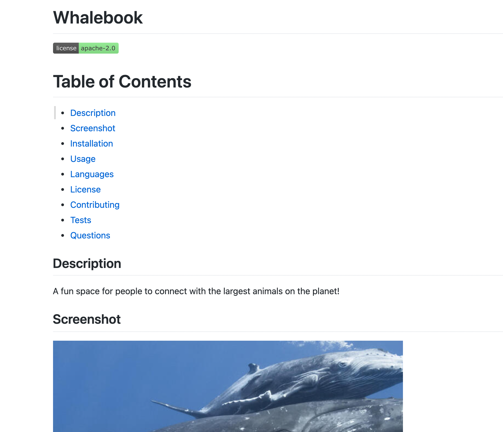

# Professional README Generator 

## Description
A terminal-based program to quickly and easily generate a professional-looking README based on the user's answers to a series of questions. Rendered READMEs include badges, screenshots, info on licensing, contact info, etc. along with a clickable table of contents.

## Screenshot

## Languages
Javascript
Node.js

## Credits
Made with care by Thomas Upchurch
